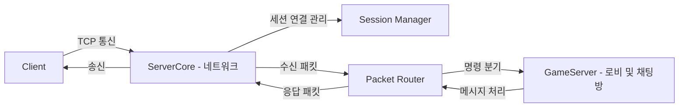

# ProjectYJ - C++ 기반 채팅 서버 프로젝트

**ProjectYJ**는 C++17과 Boost.Asio를 기반으로 개발된 고성능 멀티스레드 채팅 서버입니다.  
패킷 라우팅, 세션 관리, 채팅방 기능을 구조화하여 확장성과 안정성을 고려하여 설계되었습니다.

---

## ✨ 주요 기능

- **비동기 네트워크 통신**: Boost.Asio를 이용한 비동기 소켓 처리
- **로그인 및 세션 관리**: 고유 세션 UID 관리
- **로비 시스템**: 채팅방 리스트 조회 및 채팅방 생성
- **채팅방 시스템**: 다수 유저의 입장, 퇴장, 메시지 브로드캐스트
- **멀티스레드 최적화**: concurrent_queue를 활용한 패킷 병렬 처리
- **구조화된 패킷 라우팅**: PacketRouter를 통한 명확한 패킷 분기 처리

---

## 🛠 사용 기술

- **C++17**
- **Boost.Asio (비동기 IO 처리)**
- **Concurrent Queue (멀티스레드 큐)**
- **Multi-threading (패킷 처리 최적화)**

---

## 🖥️ 프로젝트 구조

```plaintext
ProjectYJ/
├── ServerCore/         # 네트워크 및 세션 핵심 모듈
├── GameServer/         # 로비 및 채팅방 로직
├── Protocol/           # 패킷 정의 및 직렬화/역직렬화
├── Client/             # 테스트용 클라이언트
└── README.md
```

---

## 🚀 빌드 및 실행 방법

### 1. 빌드 환경

- Visual Studio 2022 이상
- C++17 지원
- Boost 1.78.0 이상 설치

### 2. 빌드 방법

- 솔루션 파일 열기
- ServerCore, GameServer, Client 빌드

### 3. 실행 순서

1. `GameServer.exe` 실행 → 서버 시작
2. `Client.exe` 실행 → 서버 접속 후 채팅 테스트

---

## 🏗️ 아키텍처 구조



> 🔹 **ServerCore**는 저수준 네트워크 및 세션 관리를 담당하고,  
> 🔹 **PacketRouter**는 패킷 종류에 따라 GameServer 로직으로 분기합니다.  
> 🔹 **GameServer**는 로비/채팅방 로직을 처리하여 최종 응답을 생성합니다.

---

## 🎯 프로젝트 핵심 강조 포인트

| 포인트            | 설명 |
|:-------------------|:-----|
| **모듈화된 구조**    | 네트워크, 패킷, 게임 로직이 명확히 분리되어 유지보수 및 확장 용이 |
| **비동기 + 멀티스레드 최적화** | IO 처리와 패킷 처리를 분리하여 고부하 상황에도 안정적인 처리 |
| **확장성 고려** | 새로운 기능 추가(예: 친구 추가, 귓속말 기능) 시 최소한의 수정으로 대응 가능 |

---

## 📈 개발 예정 사항

- 클라이언트 재접속 처리
- 채팅방 최대 인원 제한
- 관리용 콘솔 커맨드 기능 추가
- 서버 부하 분산 처리 (Worker Thread Pool 개선)

---
